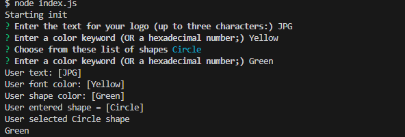
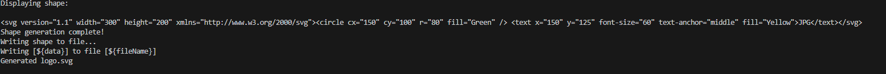
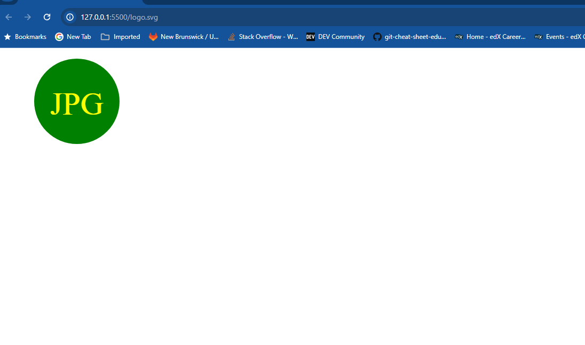

# SVG-Generator
https://drive.google.com/file/d/1jimVbLc7hfYlT2xF5mcoNZOxB1V1liu_/view
https://github.com/imbanu1/SVG-Generator
http://127.0.0.1:5500/logo.svg

GIVEN a command-line application that accepts user input

WHEN I am prompted for text
THEN I can enter up to three characters

WHEN I am prompted for the text color
THEN I can enter a color keyword (OR a hexadecimal number)

WHEN I am prompted for a shape
THEN I am presented with a list of shapes to choose from: circle, triangle, and square

WHEN I am prompted for the shape's color
THEN I can enter a color keyword (OR a hexadecimal number)

WHEN I have entered input for all the prompts
THEN an SVG file is created named `logo.svg`

AND the output text "Generated logo.svg" is printed in the command line
WHEN I open the `logo.svg` file in a browser
THEN I am shown a 300x200 pixel image that matches the criteria I entered
